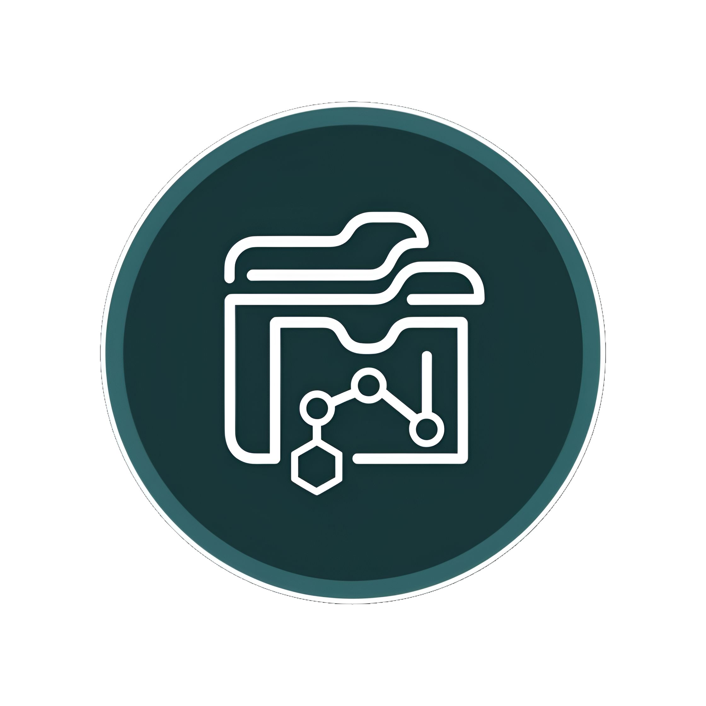
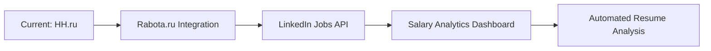

<!-- Logo Section -->
<div align="center">
  
  <h1>CareerCrawler</h1>
</div>

<!-- Status Badges -->
<div align="center">

[](https://dotnet.microsoft.com)
[](LICENSE)
[](https://github.com/PipainS/HHParser/commits/main)
[](https://github.com/PipainS/HHParser)

</div>

---

## 📖 About

**CareerCrawler** is a powerful console application for analyzing job market data through API aggregation. Currently supporting HH.ru with plans to expand to other platforms.

**Key Features**:
- 🎯 Professional role/specialization catalogs
- 💾 Vacancy dataset generation (C# example: 5000+ entries)
- 📁 CSV export capabilities
- 🔁 Resilient API communication with Polly retries

🔮 **Future Roadmap**

## 🚀 Getting Started

To run the project locally, follow these steps:

### Prerequisites
- [.NET 8.0](https://dotnet.microsoft.com/) must be installed.

### Setup Instructions

```bash
# Clone repository
git clone https://github.com/PipainS/CareerCrawler.git
cd CareerCrawler/CareerCrawler

# Restore packages
dotnet restore

# Run with sample parameters
dotnet run
```
## 📜 License

```text
MIT License

Copyright (c) 2024 PipainS
```
<div align="center" style="margin-top: 40px">  </div> 
